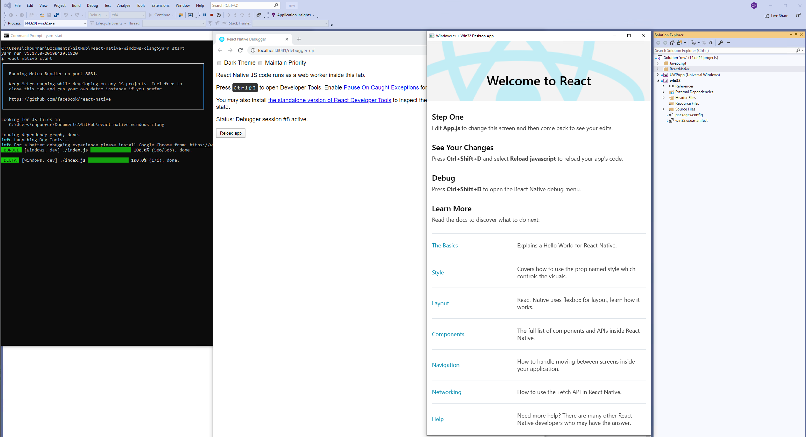

# react-native-windows-clang
Sample using react-native-windows inside a plain old win32 window, using the Clang compiler (WIP)

## Start

To clone and run this repository you'll need [Git](https://git-scm.com), [Node.js](https://nodejs.org/en/download/) (which comes with [npm](http://npmjs.com)) installed on your computer. 

### From your command line:

```bash
# Clone this repository
git clone https://github.com/christophpurrer/react-native-windows-clang.git
# Change to the repository
cd react-native-windows-clang
# Install dependencies - This will patch react-native-windows via `postinstall` step
yarn install
# Start Metro
yarn start
```
### Building using Visual Studio 2019 ...

1.) Open *windows\rnw.sln* and set the startup project to **win32**

2.) [Optionally] Choose *Build / Build Solution*

2.) Run **win32** project



### Building from command line ...
[Tba]

## How this project was setup?
This sneaky example leverages a set of technologies:

1.) [Xaml Islands](https://docs.microsoft.com/en-us/windows/apps/desktop/modernize/using-the-xaml-hosting-api) >> [Sample](https://github.com/marb2000/XamlIslands/tree/master/1903_Samples/CppWinRT_Win32_SimpleApp/Win32DesktopApp)

2.a) [Embed Manifest via command line](https://docs.microsoft.com/en-us/cpp/build/how-to-embed-a-manifest-inside-a-c-cpp-application?view=vs-2019) with [mt.exe](https://docs.microsoft.com/en-us/windows/win32/sbscs/mt-exe)

2.b) [Reg-Free WinRT](https://blogs.windows.com/windowsdeveloper/2019/04/30/enhancing-non-packaged-desktop-apps-using-windows-runtime-components/) for activation >> [Sample](https://github.com/Microsoft/RegFree_WinRT/tree/master/Cpp)

3.) [Generate most minimal resources.pri](windows/createResources.bat) via [MakePri.exe](https://docs.microsoft.com/en-us/windows/uwp/app-resources/makepri-exe-command-options) 

4.) [VCRT Forwarding](https://www.nuget.org/packages/Microsoft.VCRTForwarders.140) DLLs for runtime

See [WinRT documentation](https://docs.microsoft.com/en-us/windows/uwp/cpp-and-winrt-apis/get-started) in case you are unfamiliar with it.
### Not needed anymore:
- [react-native-windows as a Windows Runtime Component](https://techcommunity.microsoft.com/t5/windows-dev-appconsult/getting-started-with-react-native-for-windows/ba-p/912093) >> [C# Sample](https://github.com/microsoft/react-native-windows-samples/tree/master/samples/TodosFeed/TodosFeed/windows)
- [UWP Store App exported as .DLL with dummy.exe trick](https://github.com/marb2000/XamlIslands/tree/master/1903_Samples/CppWinRT_Win32_SingleIsland) >> Study the entire [README.MD](https://github.com/marb2000/XamlIslands/blob/master/1903_Samples/CppWinRT_Win32_SingleIsland/ReadMe.md)

## Some words of caution
- Xaml Islands and therefore this project require [Windows 10 1903](https://en.wikipedia.org/wiki/Windows_10_version_history)
- Once [WinUI 3.0](https://docs.microsoft.com/en-us/uwp/toolkits/winui3) is ready, you should be able to support Windows 10 1703, as Xaml Islands gets extracted out of the Windows 10 SDK
- VCRT Forwarding just *'forwards to runtime components of Visual C++ libraries which are required to run Visual C++ applications'*. Ensure that. See [https://github.com/Microsoft/vcrt-forwarders](https://github.com/Microsoft/vcrt-forwarders) and [Visual C++ Redistributable Packages](https://aka.ms/AA4pp63)
